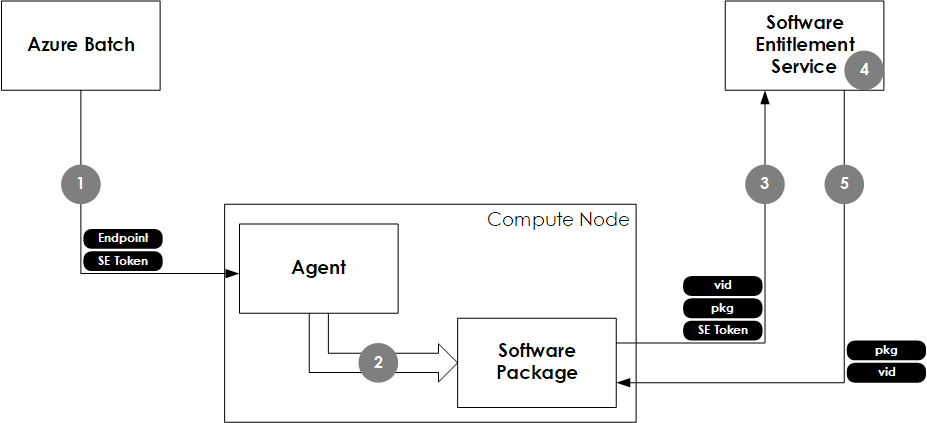

# Software Entitlement Service for Azure Batch

The  Software Entitlement Service of Azure Batch allows a software package to verify it is running in an environment where usage metering takes place. This SDK provides tooling and documentation to support software vendors integrating with the service.

The SDK includes the following:

* [Software entitlement library code](src/Microsoft.Azure.Batch.SoftwareEntitlement.Client.Native) for integration into applications.  The interface is native C++ and is provided as source code ready for use.

* A command line utility ([sestest](src/sestest)) is provided to assist with testing of the integration. This utility supports token generation and can emulate a software entitlement server for testing outside of the Batch environment.

* Reference documentation on the [REST API](src/Microsoft.Azure.Batch.SoftwareEntitlement.Server), detailing the interaction between the library code used by the software application and the software entitlement server. 

## Overview

Azure Batch will provide two environment variables (1) for consumption by a metered software package - a software entitlement token and a URL for a software entitlement server for verification of that token. The software package will retrieve both environment variables (2) and securely contact the appropriate server requesting an entitlement to execute (3). The Software Entitlement Server will check the entitlement for the software package (4) and respond with either *Approved* or *Denied* (5).

## Task Scheduling

The Batch service provides two pieces of information to a metered software application through environment variables:

| Variable                              | Definition                                                                                                        |
| ------------------------------------- | ----------------------------------------------------------------------------------------------------------------- |
| `AZ_BATCH_ACCOUNT_URL`                | The uri of an endpoint for the batch service account. 
 Sample: `https://{myaccount}.{region}.batch.azure.com` |
| `AZ_BATCH_SOFTWARE_ENTITLEMENT_TOKEN` | An encoded string containing the actual software entitlement token.                                               |

The software package will check that the provided batch account endpoint specifies a *known host* (such as `*.batch.azure.com` or one of the equivalents for national clouds); if it does not, the software package should not consider itself entitled. If the endpoint is known, the software application will request a software entitlement from the specified server over a secured HTTPS/TLS connection.

*The software package is not expected to decrypt or otherwise process the software entitlement token aside from passing it to the Software Entitlement Service for verification.*

## How it Works

The software entitlement token will be an encrypted and signed JWT token containing information about the virtual machine, the task and the permitted software packages.

The software application will authenticate the software entitlement server by only contacting known hosts and by pinning the HTTPS/TLS connection to a certificate chain known to be issued by Microsoft Azure. 

The software entitlement server will authenticate the software package by comparing the request with details found inside the encrypted and signed entitlement token, including the application id, network address, and current time.

# Contributing

This project has adopted the [Microsoft Open Source Code of Conduct](https://opensource.microsoft.com/codeofconduct/). For more information see the [Code of Conduct FAQ](https://opensource.microsoft.com/codeofconduct/faq/) or contact [opencode@microsoft.com](mailto:opencode@microsoft.com) with any additional questions or comments.
