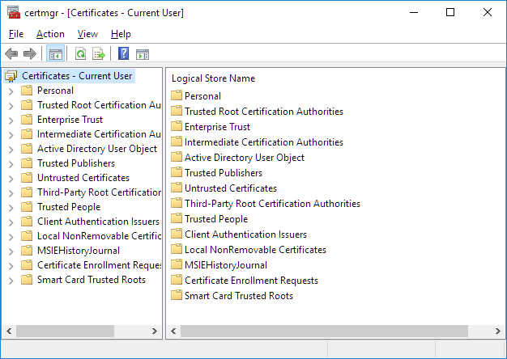
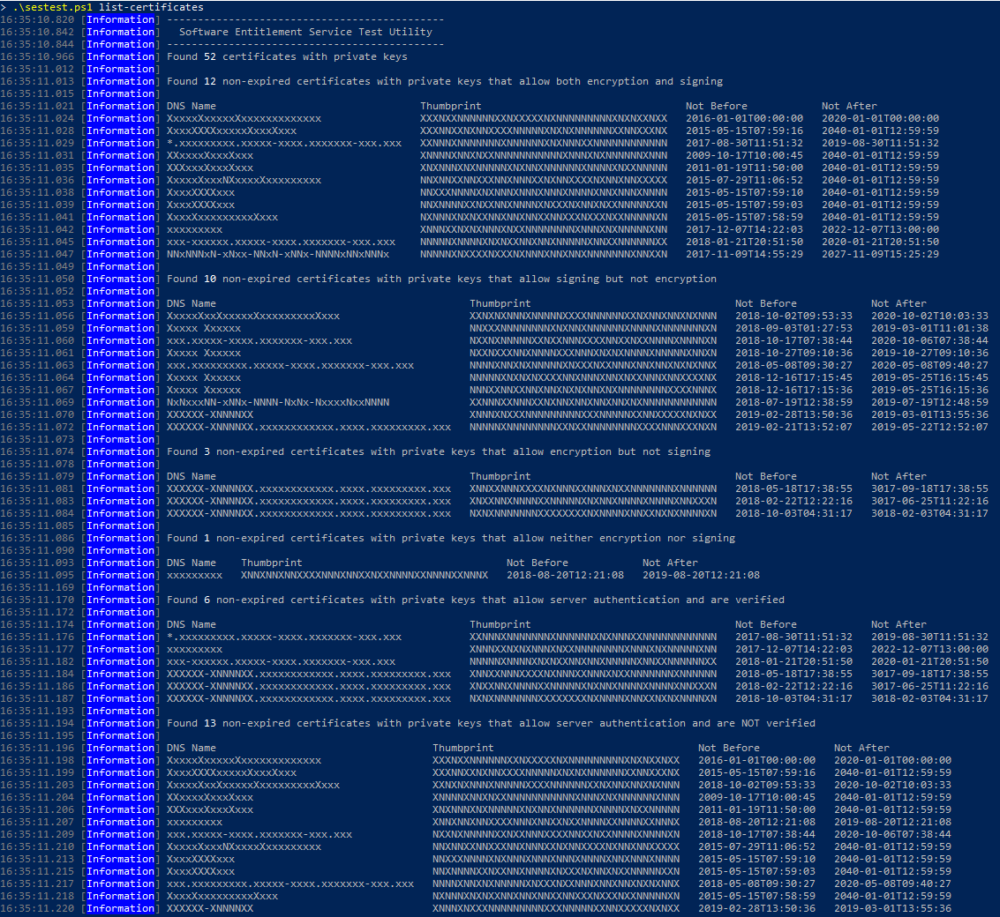

# Finding Certificates

The Azure Batch software entitlement service makes use of digital certificates to secure network communication and the tokens themselves:

* one to digitally sign the generated entitlement token,
* one to encrypt the generated entitlement token, and
* one to authenticate the software entitlement service.

In production, three different certificates are used, but for test scenarios you can use the same certificate for all three.

For each required certificate you will need to know its *thumbprint*. Both condensed (e.g. `d4de20d05e66fc53fe1a50882c78db2852cae474`) and expanded (e.g. `d4 de 20 d0 5e 66 fc 53 fe 1a 50 88 2c 78 db 28 52 ca e4 74`) formats are supported.

If you already have suitable certificates on your machine (e.g. if you use HTTPS locally for development and testing), you can use those. See [*Finding Certificates*](finding-certificates.md) for information on finding a certificate on your machine.

If you don't already have suitable certificates (or if you're not sure), creating your own certificates is straightforward. The blog entry [Creating self signed certificates with makecert.exe for development](https://blog.jayway.com/2014/09/03/creating-self-signed-certificates-with-makecert-exe-for-development/) is one useful guide for this.


## Finding certificates on Windows

On the Windows platform, one way to find suitable certificates is to use the built in certificate manager.



At minimum, you must use a certificate that has a private key.


## Finding certificates with the SDK

To assist with finding a suitable certificate, the `sestest` utility has a `list-certificates` mode that will list certificates that *may* work (the tool lists certificates with a private key but doesn't check for other characteristics):

``` PowerShell
.\sestest list-certificates
```

The output from this command is tabular, so we recommend using a console window that is as wide as possible.



(Yes, this output is obfuscated.)

### Checking a thumbprint

Once you've selected a thumbprint for use, you can verify it using `sestest` (Substitute your own thumbprint for `XXX`):

``` PowerShell
.\sestest find-certificate --thumbprint XXXXXXXXXXXXXXXXXXXXXXXXXXXXXXXXXXXXXXXX
```

For a thumbprint containing whitespace (as it will if copied from the Windows certificate properties dialog), wrap the thumbprint in quotes:

``` PowerShell
.\sestest find-certificate --thumbprint "XX XX XX XX XX XX XX XX XX XX XX XX XX XX XX XX XX XX XX XX"
```

If `sestest` finds the certificate, some information will be shown:

``` 
10:26:13.119 [Information] ---------------------------------------------
10:26:13.119 [Information]   Software Entitlement Service Test Utility
10:26:13.119 [Information] ---------------------------------------------
10:26:13.168 [Information] [Subject]
10:26:13.170 [Information]   CN=localhost
10:26:13.171 [Information]
10:26:13.171 [Information] [Issuer]
10:26:13.172 [Information]   CN=localhost
10:26:13.174 [Information]
10:26:13.175 [Information] [Serial Number]
10:26:13.176 [Information]   XXXXXXXXXXXXXXXXXXXXXXXXXXXXXXXX
10:26:13.177 [Information]
10:26:13.180 [Information] [Not Before]
10:26:13.182 [Information]   7/12/2016 10:50:46 AM
10:26:13.182 [Information]
10:26:13.184 [Information] [Not After]
10:26:13.185 [Information]   7/12/2021 12:00:00 PM
10:26:13.186 [Information]
10:26:13.187 [Information] [Thumbprint]
10:26:13.188 [Information]   XXXXXXXXXXXXXXXXXXXXXXXXXXXXXXXXXXXXXXXX
```

If `sestest` is unable to find the certificate, you will get an error:

``` 
10:34:59.211 [Information] ---------------------------------------------
10:34:59.211 [Information]   Software Entitlement Service Test Utility
10:34:59.211 [Information] ---------------------------------------------
10:34:59.305 [Error] Did not find cert certificate XXXXXXXXXXXXXXXXXXXXXXXXXXXXXXXXXXXXXXXX
```

