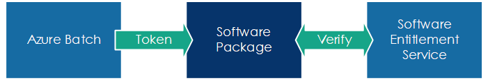

# Software Entitlement Service Walk-through

Many independent software vendors (ISVs) require users to obtain a license from a server in order to run their software. The traditional license server model is difficult to implement in the cloud. Azure Batch provides a way for ISVs who partner with Microsoft to meter usage, and to enforce that users may only use their software within the Azure Batch environment where that usage can be metered, without the need for a license server.

This walk-through describes how the *Software Entitlement Service SDK* is used to enable integration of licensed commercial software with Azure Batch.

## Overview

In production, Azure Batch will generate a software entitlements token for each task run on a compute node. The application software installed on the node (for the purposes of this walk-through, ContosoApp) securely contacts a software entitlement server to verify that the token is authentic. 



During development, it is important to be able to test locally. The Software Entitlement Service SDK enables this by providing substitutes for the components normally available only in the cloud:


## Prerequisites

Before working through this guide, you will need to have built the tooling and have it ready for execution. See the [Guide to building the Software Entitlement Service SDK](build-guide.md) for details of doing this.

## A note on shells

The SDK has been written to be cross-platform, working on Windows, Linux and macOS. This walk-through uses **PowerShell** (usable on both Windows and [Linux](https://azure.microsoft.com/blog/powershell-is-open-sourced-and-is-available-on-linux/)) and **bash**; the commands shown should be trivially convertible to your shell of choice, such as `CMD`.

**Note:** By default, execution of PowerShell scripts is disabled on many Windows systems. If you get an error "*script.ps1* cannot be loaded because running scripts is disabled on this system", you will need to unblock scripts by running `set-executionpolicy remotesigned` from an elevated PowerShell window.

There are `PowerShell` and `bash` wrappers in the repository root to launch `sestest`. These find and run the latest `sestest.dll` assembly that has been built.

## Selecting Certificates

In production, the software entitlement service generates tokens that are both digitally signed and encrypted in order to prevent misuse. The service also requires connections to be made via HTTPS. To simulate this in a local dev/test environment, we need to select one or more digital certificates that are available on the local machine.

The software entitlement service makes use of three digital certificates:

* one to digitally sign the generated entitlement token,
* one to encrypt the generated entitlement token, and
* one to authenticate the software entitlement service.

In production, three different certificates will be used, but for test scenarios you can use the same certificate for all three.

For each required certificate you will need to know its *thumbprint*. Both condensed (e.g. `d4de20d05e66fc53fe1a50882c78db2852cae474`) and expanded (e.g. `d4 de 20 d0 5e 66 fc 53 fe 1a 50 88 2c 78 db 28 52 ca e4 74`) formats are supported.

If you already have suitable certificates on your machine (e.g. if you use HTTPS locally for development and testing), you can use those. See [*Finding Certificates*](finding-certificates.md) for information on finding a certificate on your machine.

If you don't already have suitable certificates (or if you're not sure), creating your own certificates is straightforward. The blog entry [Creating self signed certificates with makecert.exe for development](https://blog.jayway.com/2014/09/03/creating-self-signed-certificates-with-makecert-exe-for-development/) is one useful guide for this on Windows. Alternatively, the .NET Core SDK [can be used](https://docs.microsoft.com/en-us/aspnet/core/security/enforcing-ssl#trust-the-aspnet-core-https-development-certificate-on-windows-and-macos) to create and trust a certificate for server authentication (again, Windows only: the `--trust` option is unavailable on Linux).

## Starting the test server

In production, your application will read a token from the `AZ_BATCH_SOFTWARE_ENTITLEMENT_TOKEN` environment variable (populated by Azure Batch). Your application will provide that to the software entitlement server, which will verify the token grants an entitlement to use your application, _and_ validate that the compute node requesting verification of the token is the virtual machine to which the token was issued.

The production software entitlement server only accepts connections from Azure Batch compute nodes. To enable your local development/test environment, the `server` mode of `sestest` provides an HTTPS endpoint that acts as a fully functioning server.

Set the variable `connectionThumbprint` to specify the certificate that should be used for HTTPS. This must be a certificate that is valid for server authentication. Depending on the client tool which will be used for making requests to the test server, the certificate may also need to be trusted/verified (see [finding certificates with the SDK](finding-certificates.md#finding-certificates-with-the-sdk)).

``` PowerShell
# PowerShell
PS> $connectionThumbprint = "XXXXXXXXXXXXXXXXXXXXXXXXXXXXXXXXXXXXXXXX"
```
``` bash
# bash
$ connectionThumbprint="XXXXXXXXXXXXXXXXXXXXXXXXXXXXXXXXXXXXXXXX"
```

Defining variables makes it easier to type the commands and reduces the opportunity for error. (Both `PowerShell` and `bash` do auto completion of variable names.)

In production, Azure Batch requires software entitlement tokens that are both signed and encrypted. The digital signature allows the production software entitlement server to verify tokens were generated by Azure Batch, and the encryption prevents the signature from being stripped from the token and replaced.

When working in a local development/test environment, signing and encryption of tokens are both optional. We do recommend that you do at least some testing with fully secured tokens as they are significantly longer.

You may use the same certificate for both signing and encryption if you prefer.

To run the test server such that it accepts tokens which are _not_ signed or encrypted, only specify the `--connection` option. The `--connection` option is mandatory because the server only works with an HTTPS connection.

``` PowerShell
# PowerShell
PS> .\sestest.ps1 server --connection $connectionThumbprint
```
``` bash
# bash
$ ./sestest.sh server --connection $connectionThumbprint
```

If you will be testing with signed and/or encrypted tokens, set the variables `signingThumbprint` and/or `encryptingThumbprint` to thumbprints of certificates which are valid for signing (digital signature) and encryption (data encipherment) respectively.

Remember which certificates you use for signing and encryption as you'll need to provide the same thumbprints to `sestest generate` to generate compatible tokens (described [below](#generating-signed-and-encrypted-tokens)).

``` PowerShell
# PowerShell
PS> $signingThumbprint = "XXXXXXXXXXXXXXXXXXXXXXXXXXXXXXXXXXXXXXXX"
PS> $encryptingThumbprint = "XXXXXXXXXXXXXXXXXXXXXXXXXXXXXXXXXXXXXXXX"
```
``` bash
# bash
$ signingThumbprint="XXXXXXXXXXXXXXXXXXXXXXXXXXXXXXXXXXXXXXXX"
$ encryptingThumbprint="XXXXXXXXXXXXXXXXXXXXXXXXXXXXXXXXXXXXXXXX"
```

And specify these when running the server:

``` PowerShell
# PowerShell
PS> .\sestest.ps1 server --connection $connectionThumbprint --sign $signingThumbprint --encrypt $encryptingThumbprint
```
``` bash
# bash
$ ./sestest.sh server --connection $connectionThumbprint --sign $signingThumbprint --encrypt $encryptingThumbprint
```

For a full reference of all the available parameters for this mode, see [../src/sestest/readme.md](../src/sestest/readme.md).

The server will start up and wait for connections.

```
17:20:02.676 [Information] ---------------------------------------------
17:20:02.695 [Information]   Software Entitlement Service Test Utility
17:20:02.696 [Information] ---------------------------------------------
17:20:02.977 [Debug] Hosting starting
17:20:03.043 [Debug] Hosting started
Hosting environment: Production
Content root path: ... elided ...
Now listening on: https://localhost:4443
Application started. Press Ctrl+C to shut down.
```

Test the server with a web browser, connecting to the server by entering the URL shown on the console.


Only an HTTPS connection will work. The server does not listen for HTTP connections. If you specified any kind of locally signed certificate, you will likely need to override security features of your browser to connect.

Leave the server running in this shell window.

## Generating a token

Assuming the server is running in the current shell window, open up a new shell to generate the token. You may want to arrange the two windows so you can observe the one running the test server while you work in the other.

In production, Azure Batch will generate a software entitlement token and make it available in the environment variable `AZ_BATCH_SOFTWARE_ENTITLEMENT_TOKEN`. For local development and testing, we can use `generate` mode of `sestest` to generate a token and then manually define the required variable.

Set the variable `applicationId` to store the application ID for which the token will grant entitlement (this same variable can be used later for verifying the token):

``` PowerShell
# PowerShell
PS> $applicationId = "contosoapp"
```
``` bash
# bash
$ applicationId="contosoapp"
```

### Generating a plaintext token

Run the `sestest generate` command to generate a minimal (unsigned and unencrypted) token and store it in `token.txt` within the `tmp` directory, where it won't be tracked by source control:

``` PowerShell
# PowerShell
PS> .\sestest.ps1 generate --application-id $applicationId --token-file tmp\token.txt
```
``` bash
# bash
$ ./sestest.sh generate --application-id $applicationId --token-file tmp/token.txt
```

The `token.txt` file will contain the software entitlement token, stored as a single line of encoded text.

To see more details about what's included in the token, optionally include the option `--log-level debug`. For a full reference of all the available parameters for this mode, see [../src/sestest/readme.md](../src/sestest/readme.md).

### Generating signed and encrypted tokens

Depending [how the server was started](#starting-the-test-server), the token may need to be signed and/or encrypted.

If so, set the `signingThumbprint` and/or `$encryptingThumbprint` variables to the appropriate thumbprint values to make it easier to reference the thumbprints:

``` PowerShell
# PowerShell
PS> $signingThumbprint = "XXXXXXXXXXXXXXXXXXXXXXXXXXXXXXXXXXXXXXXX"
PS> $encryptingThumbprint = "XXXXXXXXXXXXXXXXXXXXXXXXXXXXXXXXXXXXXXXX"
```
``` bash
# bash
$ signingThumbprint="XXXXXXXXXXXXXXXXXXXXXXXXXXXXXXXXXXXXXXXX"
$ encryptingThumbprint="XXXXXXXXXXXXXXXXXXXXXXXXXXXXXXXXXXXXXXXX"
```

Add the options `--sign` and `--encrypt` to the command line used above to generate a fully secured token:

``` PowerShell
# PowerShell
PS> .\sestest.ps1 generate --application-id $applicationId --sign $signingThumbprint --encrypt $encryptingThumbprint --token-file tmp/token.txt
```
``` bash
# bash
$ ./sestest.sh generate --application-id $applicationId --sign $signingThumbprint --encrypt $encryptingThumbprint --token-file tmp/token.txt
```

Open `token.txt` in your favorite text editor; you'll see that the secured token is substantially longer than an unsecured one.

### Storing the token in a variable

Set the environment variable `AZ_BATCH_SOFTWARE_ENTITLEMENT_TOKEN` to the content of the `token.txt` file:

``` PowerShell
# PowerShell
PS> $env:AZ_BATCH_SOFTWARE_ENTITLEMENT_TOKEN = (get-content tmp\token.txt)
```
``` bash
# bash
$ AZ_BATCH_SOFTWARE_ENTITLEMENT_TOKEN=`cat tmp/token.txt`
```

Testing with an encrypted token is useful because these are significantly longer, in part due to information about the required key that's included within. (This may reveal issues, such as buffer sizes that are too small, that an unencrypted token would not.) Note that your application doesn't need to do anything different with encrypted vs unencrypted tokens. 

## Verifying a token

There are a few options for independently checking the software entitlement token. This allows you to check the consistency of the system without involving your application, helping you to identify the source of any issues.

In the same shell window used to generate the token, define an environment variable with the URL shown by the server:

``` PowerShell
# PowerShell
PS> $env:AZ_BATCH_ACCOUNT_URL = "https://localhost:4443"
```
``` bash
# bash
$ AZ_BATCH_ACCOUNT_URL="https://localhost:4443"
```

You should now have the following variables defined:
- `AZ_BATCH_SOFTWARE_ENTITLEMENT_TOKEN`
- `AZ_BATCH_ACCOUNT_URL`
- `applicationId`

### Verifying using `sesclient`

On Windows, you can use the `sesclient` console application. This requires specifying a `--thumbprint` value that matches the `connection` certificate used by the test server.

``` PowerShell
# PowerShell
PS> $connectionThumbprint = "XXXXXXXXXXXXXXXXXXXXXXXXXXXXXXXXXXXXXXXX"
PS> .\sesclient.ps1 --url $env:AZ_BATCH_ACCOUNT_URL --thumbprint $connectionThumbprint --common-name localhost --token $env:AZ_BATCH_SOFTWARE_ENTITLEMENT_TOKEN --application $applicationId
```

### Verifying using shell commands

If you are having difficulty running `sesclient` (for example the server is using a self-signed certificate), you can do a partial verification using your shell.

These will verify your token (from the environment variable `AZ_BATCH_SOFTWARE_ENTITLEMENT_TOKEN`) against the server, but won't do any of the required local checks that ensure you're talking to a genuine service.

Examples here use PowerShell (`Invoke-RestMethod`) or Bash (`curl` with `jq` for JSON parsing).

**Notes:**
- In PowerShell v6 (the cross-platform one), `Invoke-RestMethod` deems the `Content-Type: application/json; odata=minimalmetadata` header invalid. If you're using this version you'll need to specify the `-SkipHeaderValidation` option.
- `Invoke-RestMethod` in PowerShell v5 and earlier refuses to connect to endpoints bearing an untrusted TLS certificate. This can be overridden in v6 with the `-SkipCertificateCheck` option.

The details of the requests depend on the API version you're testing against. An API version of `9999-09-09.99.99` indicates the newer "leasing" API, while versions below that correspond to the one-time approval API.

#### One-time token approval API

Send a `POST` request to the API, specifying an `api-version` parameter between `2017-05-01.5.0` and `2018-08-01.7.0`:

``` PowerShell
# PowerShell
PS> Invoke-RestMethod `
    -Uri "$env:AZ_BATCH_ACCOUNT_URL/softwareEntitlements?api-version=2017-09-01.6.0" `
    -Method "POST" `
    -Body "{'applicationId':'$applicationId', 'token':'$env:AZ_BATCH_SOFTWARE_ENTITLEMENT_TOKEN'}" `
    -ContentType "application/json; odata=minimalmetadata" | ConvertTo-Json
```
``` bash
# bash
$ curl \
    --request POST \
    --insecure      `# Skip certificate check` \
    --fail          `# Exit with error code on HTTP error code` \
    --show-error    `# Output HTTP errors to stderr` \
    --silent        `# Don't write progress bar to stderr` \
    --header "Content-Type: application/json; odata=minimalmetadata" \
    --data "{'applicationId':'$applicationId', 'token':'$AZ_BATCH_SOFTWARE_ENTITLEMENT_TOKEN'}" \
    $AZ_BATCH_ACCOUNT_URL/softwareEntitlements?api-version=2017-09-01.6.0 \
    | jq
```

The output should be similar to:
```json
{
  "id": "entitlement-695c822b-470c-4fd1-b34d-9b21435f57b2",
  "expiry": "2019-01-16T01:06:07+00:00"
}
```

#### Leasing API

Interacting with leased entitlements involves three kinds of requests: acquisition, renewal and release.

For these we require an `api-version` parameter of `9999-09-09.99.99`.

##### Acquisition

Send a `POST` request to the API to acquire an entitlement and write leased entitlement ID to the `entitlementId` variable:

``` PowerShell
# PowerShell
PS> $entitlementId = (Invoke-RestMethod `
    -Uri "$env:AZ_BATCH_ACCOUNT_URL/softwareEntitlements?api-version=9999-09-09.99.99" `
    -Method "POST" `
    -Body "{'applicationId':'$applicationId', 'token':'$env:AZ_BATCH_SOFTWARE_ENTITLEMENT_TOKEN','duration':'PT5M'}" `
    -ContentType "application/json; odata=minimalmetadata" `
    ).entitlementId
```
``` bash
# bash
$ entitlementId=$(curl \
    --request POST \
    --insecure \
    --fail \
    --show-error \
    --silent \
    --header "Content-Type: application/json; odata=minimalmetadata" \
    --data "{'applicationId':'$applicationId', 'token':'$AZ_BATCH_SOFTWARE_ENTITLEMENT_TOKEN','duration':'PT5M'}" \
    $AZ_BATCH_ACCOUNT_URL/softwareEntitlements?api-version=9999-09-09.99.99 \
    | jq -re '.entitlementId' || (echo "FAILED: entitlementId not found in JSON response" 1>&2))
```

##### Renewal

Send a `POST` request to the endpoint for `entitlementId` to renew the entitlement and write formatted JSON response to stdout:

``` PowerShell
# PowerShell
PS> Invoke-RestMethod `
    -Uri "$env:AZ_BATCH_ACCOUNT_URL/softwareEntitlements/${entitlementId}?api-version=9999-09-09.99.99" `
    -Method "POST" `
    -Body "{'duration':'PT5M'}" `
    -ContentType "application/json; odata=minimalmetadata" | ConvertTo-Json
```
``` bash
# bash
$ curl \
    --request POST \
    --insecure \
    --fail \
    --show-error \
    --silent \
    --header "Content-Type: application/json; odata=minimalmetadata" \
    --data "{'duration':'PT5M'}" \
    $AZ_BATCH_ACCOUNT_URL/softwareEntitlements/$entitlementId?api-version=9999-09-09.99.99 \
    | jq
```

The output should be similar to:
```json
{
  "expiryTime": "2019-01-16T01:10:07+00:00"
}
```

##### Release

Send a `DELETE` request to the API at the endpoint for `entitlementId` to release the entitlement:

``` PowerShell
# PowerShell
PS> Invoke-RestMethod `
    -Uri "$env:AZ_BATCH_ACCOUNT_URL/softwareEntitlements/${entitlementId}?api-version=9999-09-09.99.99" `
    -Method "DELETE" `
    -ContentType "application/json; odata=minimalmetadata"
```
``` bash
# bash
$ curl \
    --request DELETE \
    --insecure \
    --fail \
    --show-error \
    --silent \
    --header "Content-Type: application/json; odata=minimalmetadata" \
    $AZ_BATCH_ACCOUNT_URL/softwareEntitlements/$entitlementId?api-version=9999-09-09.99.99
```

## Troubleshooting

### SSPI Errors

If the connection certificate you selected previously isn't fully trusted, the `sestest server` window will show messages like this:

```
11:48:21.194 [Error] ConnectionFilter.OnConnection
11:48:21.202 [Error] One or more errors occurred. (A call to SSPI failed, see inner exception.) (AggregateException)
11:48:21.203 [Error]     A call to SSPI failed, see inner exception. (AuthenticationException)
11:48:21.234 [Error]         The certificate chain was issued by an authority that is not trusted (Win32Exception)
```

One way to remedy this is to install the certificate as a **Trusted Root Certificate Authority**. Since this is a global configuration change on your machine, please make sure you are comfortable with the consequences before doing this.

### Using a self-signed certificate

If using a self-signed certificate, secure connection validation code in the native client library will prevent you from connecting. The error message reads:

```
libcurl_error 60: SSL certificate problem: unable to get local issuer certificate
```

To turn off these checks, modify the source code in `SoftwareEntitlementClient.cpp`, around line #415:

``` cplusplus
// During testing, if the certificate chain leaves something to be
// desired, disable the following two options by setting them to 0.
//
ThrowIfCurlError(curl_easy_setopt(_curl.get(), CURLOPT_SSL_VERIFYHOST, /* 2 */ 0));
ThrowIfCurlError(curl_easy_setopt(_curl.get(), CURLOPT_SSL_VERIFYPEER, /* 1 */ 0));
```

**NOTE**: Don't leave these checks disabled when you do the release build of your package. Failing to restore these checks will make it much easier for a man-in-the-middle attack.

### Requested Operation is not supported

If you get an error that reads:

```
15:24:39.774 [Error] The requested operation is not supported
15:24:39.777 [Error] The requested operation is not supported (WindowsCryptographicException)
```

This means the certificate you've selected does not support encryption (this is a flag set on the certificate when it is created). You will need to select a different certificate.

## Suggested test cases

Once you have successfully integrated the software entitlement library into your application, test that your application does not run in each of the following cases:

* When no value is defined for the environment `AZ_BATCH_SOFTWARE_ENTITLEMENT_TOKEN`.
* When no value is defined for the environment variable `AZ_BATCH_ACCOUNT_URL`.
* When the server identified by `AZ_BATCH_ACCOUNT_URL` is unresponsive.
* When the server identified by `AZ_BATCH_ACCOUNT_URL` returns an error (5xx response code).
* When the token has already expired.
* When the token is not yet valid.
* When the token does not enable your application but does enable other applications.
* When the token enables your application on a machine with a different IP address.

