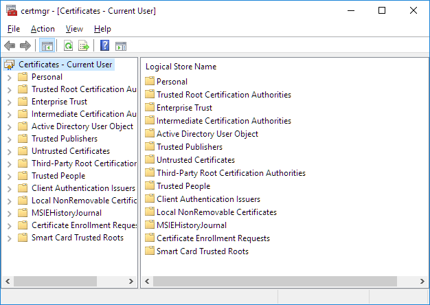
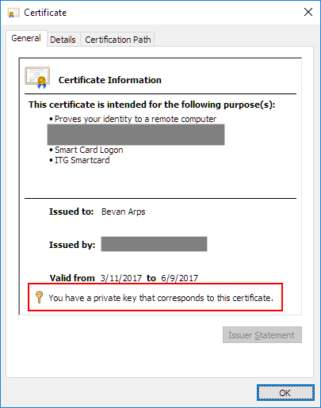
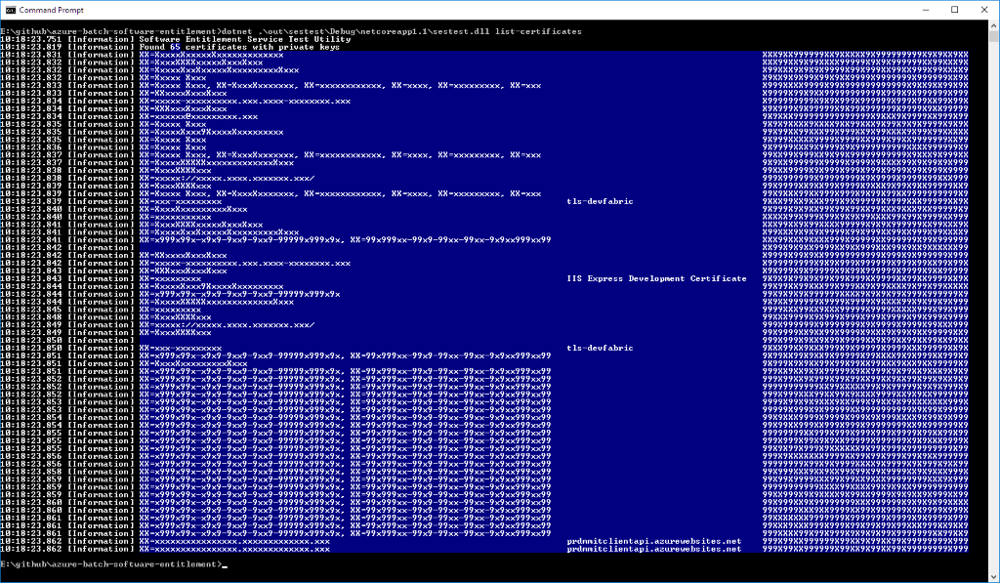

# Software Entitlement Service Walk-through

This walk-through will guide you through initial use of the Software Entitlement Service SDK, building the tooling from source code, generating and then verifying a software entitlement token.

## Table of Contents

* [Prerequisites](#prerequisites)
* [Building the tools](#building-the-tools)
* [Selecting Certificates](#selecting-certificates)
* [Generating a token](#generating-a-token)
* [Starting the test server](#starting-the-test-server)
* [Verifying a token](#verifying-a-token)

## Prerequisites

To build and use the Software Entitlement Services Test tool (`sestest`) you will need certain prerequisites installed on your system:

The `sestest` command line application and associated assemblies are written in C#7 and require version 1.1 or higher of [.NET Core](https://www.microsoft.com/net/core#windowsvs2017) to be pre-installed. The tool was written with Visual Studio 2017; it should compile with just the .NET Core installation. For more information see the [Sestest command line utility](../src/sestest/).

The C++ source for the client library requires [libcurl](https://curl.haxx.se/libcurl/) and [OpenSSL](https://www.openssl.org/) libraries as packaged by [vcpkg](https://blogs.msdn.microsoft.com/vcblog/2016/09/19/vcpkg-a-tool-to-acquire-and-build-c-open-source-libraries-on-windows/). The library was also written with Visual Studio 2017; it should compile with any modern C++ compiler. For more information (including details of configuration and use of `vcpkg`) see the [Software entitlement service native client library](../src/Microsoft.Azure.Batch.SoftwareEntitlement.Client.Native)

## Building the tools

To compile the cross platform (.NET) based tooling, open a console window to the root directory of the repo and run one of the following commands:

| Console    | Command                                                           |
| ---------- | ----------------------------------------------------------------- |
| PowerShell | `.\build-xplat.ps1`                                               |
| Cmd        | `dotnet restore .\src\sestest` <br/> `dotnet build .\src\sestest` |
| bash       | `dotnet restore ./src/sestest` <br/> `dotnet build ./src/sestest` |

* The choice of command is specific to the console being used, not the host platform, and has the 
  usual predictable differences between consoles. The PowerShell convenience script should work 
  the same on Linux as it does on Windows; the bash commands should work the same on Windows 10 as 
  they do on Linux.

To compile the native code on Windows, run one of the following commands:

| Console    | Command                                                                                                                                                                                                                  |
| ---------- | ------------------------------------------------------------------------------------------------------------------------------------------------------------------------------------------------------------------------ |
| PowerShell | `.\build-windows -platform x64 -configuration Debug`                                                                                                                                                                     |
| Cmd        | `msbuild .\src\Microsoft.Azure.Batch.SoftwareEntitlement.Client.Native /property:Configuration=Debug /property:Platform=x64` <br/> `msbuild .\src\sesclient.native /property:Configuration=Debug /property:Platform=x64` |

* These commands presume an installation of Visual Studio 2017 on the machine that includes the C++ compiler toolset
* The PowerShell convenience script uses **msbuild** directly.
* The command given for **cmd** assumes that **msbuild** is availble on the PATH (as it will be if you open a *Developer Command Prompt for VS 2017* window)
* The first `msbuild` command shown above builds the library, the second builds a wrapper executable provided for testing purposes.
* Details of the required will differ if you are using a different C++ compiler.

### Troubleshooting the builds

TBC

### Checking that it works

If compilation works without any issues, you should now have the executables you need for testing.

To verify that the `sestest` console application is ready for use, run one of the following commands from your console:

| Console    | Command                                                |
| ---------- | ------------------------------------------------------ |
| PowerShell | `.\sestest`                                            |
| Cmd        | `dotnet .\out\sestest\Debug\netcoreapp1.1\sestest.dll` |
| bash       | `dotnet ./out/sestest/Debug/netcoreapp1.1/sestest.dll` |

* Again, there is a PowerShell convenience script for use.

You should get output similar to this:

``` 
sestest 1.0.0
Copyright (C) 2017 Microsoft

ERROR(S):
  No verb selected.

  generate             Generate a token with specified parameters

  server               Run as a standalone software entitlement server.

  list-certificates    List all available certificates.

  find-certificate     Show the details of one particular certificate.

  help                 Display more information on a specific command.

  version              Display version information.
```

To verify the `sesclient.native.exe` console application is ready for use, run one of the following commands from your console:

| Console    | Command                            |
| ---------- | ---------------------------------- |
| PowerShell | `.\x64\Debug\sesclient.native.exe` |
| Cmd        | `.\x64\Debug\sesclient.native.exe` |
| bash       | `./x64/Debug/sesclient.native`     |

You should get output similar to this:

``` 
Contacts the specified azure batch software entitlement server to verify the provided token.
Parameters:
    --url <software entitlement server URL>
    --thumbprint <thumbprint of a certificate expected in the server's SSL certificate chain>
    --common-name <common name of the certificate with the specified thumbprint>
    --token <software entitlement token to pass to the server>
    --application <name of the license ID being requested>
```

## Selecting Certificates

The software entitlement service makes use of three digital certificates as follows:

* To digitally sign the generated entitlement token
* To encrypt the generated entitlement token
* To authenticate the software entitlement service

In production, three different certificates will be used, but for test scenarios you are welcome to use the same certificate for all three.

For each required certificate you will need to know the *thumbprint* of that certificate. The SES tooling is not sensitive to the format of the thumbprint.

### Windows

On the Windows platform, one way to find suitable certificates is to use the built in certificate manager.



At minimum, you must use a certificate that has a private key.



### Sestest

To assist with finding a suitable certificate, the `sestest` utility has a **list-certificates** mode that will list certificates that *may* work (the tool only shows certificates with a private key).

| Console    | Command                                                                  |
| ---------- | ------------------------------------------------------------------------ |
| PowerShell | `.\sestest list-certificates`                                            |
| Cmd        | `dotnet .\out\sestest\Debug\netcoreapp1.1\sestest.dll list-certificates` |
| bash       | `dotnet ./out/sestest/Debug/netcoreapp1.1/sestest.dll list-certificates` |

The output from this command is tabular, so we recommend using a console window that is as wide as possible.



(Yes, this output is obfuscated.)

### Checking a thumbprint

Once you've selected a thumbprint for use, you can verify it using `sestest`.

| Console    | Command                                                                                                                       |
| ---------- | ----------------------------------------------------------------------------------------------------------------------------- |
| PowerShell | `.\sestest find-certificate --thumbprint XXXXXXXXXXXXXXXXXXXXXXXXXXXXXXXXXXXXXXXX`                                            |
| Cmd        | `dotnet .\out\sestest\Debug\netcoreapp1.1\sestest.dll find-certificate --thumbprint XXXXXXXXXXXXXXXXXXXXXXXXXXXXXXXXXXXXXXXX` |
| bash       | `dotnet ./out/sestest/Debug/netcoreapp1.1/sestest.dll find-certificate --thumbprint XXXXXXXXXXXXXXXXXXXXXXXXXXXXXXXXXXXXXXXX` |

For a thumbprint containing whitespace (as it will if copied from the Windows certificate properties dialog), wrap the thumbprint in quotes.

| Console    | Command                                                                                                                                            |
| ---------- | -------------------------------------------------------------------------------------------------------------------------------------------------- |
| PowerShell | `.\sestest find-certificate --thumbprint "XX XX XX XX XX XX XX XX XX XX XX XX XX XX XX XX XX XX XX XX"`                                            |
| Cmd        | `dotnet .\out\sestest\Debug\netcoreapp1.1\sestest.dll find-certificate --thumbprint "XX XX XX XX XX XX XX XX XX XX XX XX XX XX XX XX XX XX XX XX"` |
| bash       | `dotnet ./out/sestest/Debug/netcoreapp1.1/sestest.dll find-certificate --thumbprint "XX XX XX XX XX XX XX XX XX XX XX XX XX XX XX XX XX XX XX XX"` |

If `sestest` successfully finds the certificate, some information about the certificate will be shown:

``` 
PS> .\sestest find-certificate --thumbprint XXXXXXXXXXXXXXXXXXXXXXXXXXXXXXXXXXXXXXXX
10:26:13.119 [Information] Software Entitlement Service Test Utility
10:26:13.168 [Information] [Subject]
10:26:13.170 [Information]   CN=localhost
10:26:13.171 [Information]
10:26:13.171 [Information] [Issuer]
10:26:13.172 [Information]   CN=localhost
10:26:13.174 [Information]
10:26:13.175 [Information] [Serial Number]
10:26:13.176 [Information]   XXXXXXXXXXXXXXXXXXXXXXXXXXXXXXXX
10:26:13.177 [Information]
10:26:13.180 [Information] [Not Before]
10:26:13.182 [Information]   7/12/2016 10:50:46 AM
10:26:13.182 [Information]
10:26:13.184 [Information] [Not After]
10:26:13.185 [Information]   7/12/2021 12:00:00 PM
10:26:13.186 [Information]
10:26:13.187 [Information] [Thumbprint]
10:26:13.188 [Information]   XXXXXXXXXXXXXXXXXXXXXXXXXXXXXXXXXXXXXXXX

PS>
```

If `sestest` is unable to find the certificate, you will get an error like this:

``` 
PS> .\sestest find-certificate --thumbprint XXXXXXXXXXXXXXXXXXXXXXXXXXXXXXXXXXXXXXXX
10:34:59.211 [Information] Software Entitlement Service Test Utility
10:34:59.305 [Error] Did not find cert certificate XXXXXXXXXXXXXXXXXXXXXXXXXXXXXXXXXXXXXXXX

PS>
```

## Generating a token

The `generate` mode of `sestest` is used to generate a token. The command has the following parameters:

| Parameter        | Definition                                                                                                                                                                           |
| ---------------- | ------------------------------------------------------------------------------------------------------------------------------------------------------------------------------------ |
| --application-id | Unique identifier(s) for the applications(s) to include in the entitlement (comma separated).                                                                                        |
| --vmid           | Unique identifier for the Azure virtual machine (mandatory).                                                                                                                         |
| --not-before     | The moment at which the token becomes active and the application is entitled to execute <br/> Format 'hh:mm d-mmm-yyyy'; 24 hour clock; local time; defaults to now.                 |
| --not-after      | The moment at which the token expires and the application is no longer entitled to execute <br/> Format 'hh:mm d-mmm/-yyyy'; 24 hour clock; local time; defaults to 7 days from now. |
| --address        | The externally visible IP addresses of the machine entitled to execute the application(s). <br/> Defaults to all the IP addresses of the current machine.                            |
| --sign           | Certificate thumbprint of the certificate used to sign the token                                                                                                                     |
| --encrypt        | Certificate thumbprint of the certificate used to encrypt the token.                                                                                                                 |
| --token-file     | The name of a file into which the token will be written <br/> Token will be logged otherwise.                                                                                        |
| --log-level      | Specify the level of logging output. <br/> One of *error*, *warning*, *information* or *debug*; defaults to *information*.                                                           |
| --log-file       | Specify a file into which log messages should be written. <br/> Logging is shown on the console by default.                                                                          |

You can see this documentation for yourself by running `sestest generate --help` in your console.

Run `sestest generate` with no parameters

| Console    | Command                                                                                                                       |
| ---------- | ----------------------------------------------------------------------------------------------------------------------------- |
| PowerShell | `.\sestest generate`                                            |
| Cmd        | `dotnet .\out\sestest\Debug\netcoreapp1.1\sestest.dll generate` |
| bash       | `dotnet ./out/sestest/Debug/netcoreapp1.1/sestest.dll generate` |

```
PS> .\sestest generate
10:53:59.102 [Information] Software Entitlement Service Test Utility
10:53:59.164 [Error] No applications specified.
10:53:59.164 [Error] No virtual machine identifier specified.

PS>
```

Running `sestest generate` with just the mandatory parameters supplied will generate a minimal token.

| Console    | Command                                                                                                                       |
| ---------- | ----------------------------------------------------------------------------------------------------------------------------- |
| PowerShell | `.\sestest generate --vmid machine-identifier --application-id contosoapp`                                            |
| Cmd        | `dotnet .\out\sestest\Debug\netcoreapp1.1\sestest.dll generate --vmid machine-identifier --application-id contosoapp` |
| bash       | `dotnet ./out/sestest/Debug/netcoreapp1.1/sestest.dll generate --vmid machine-identifier --application-id contosoapp` |


```
10:57:15.616 [Information] Software Entitlement Service Test Utility
10:57:15.882 [Information] Token: "eyJhbGciOiJub25lIiwidHlwIjoiSldUIn0.eyJ2bWlkIjoibWFjaGluZS1pZGVu
dGlmaWVyIiwiaXAiOlsiMTAuMTY4LjI0NC4xNDIiLCJmZTgwOjpiOTZjOjMyYTY6ZTI0OjVjN2QlNCIsIjI0MDQ6ZjgwMTo2ODE
4OjIxMjpiOTZjOjMyYTY6ZTI0OjVjN2QiLCI6OjEiLCIxMjcuMC4wLjEiLCIyNDA0OmY4MDE6NjgxODoyMTI6ODg0Mzo5YWI2Oj
JkZWI6OGRjMSJdLCJhcHAiOiJjb250b3NvYXBwIiwibmJmIjoxNDkyNjQyNjM1LCJleHAiOjE0OTMyNDc0MzUsImlhdCI6MTQ5M
jY0MjYzNSwiaXNzIjoiaHR0cHM6Ly9iYXRjaC5henVyZS5jb20vc29mdHdhcmUtZW50aXRsZW1lbnQiLCJhdWQiOiJodHRwczov
L2JhdGNoLmF6dXJlLmNvbS9zb2Z0d2FyZS1lbnRpdGxlbWVudCJ9."
```
(This has been artificially wrapped at 100 columns width.)

Include the option `--log-level debug` to get more information about what is included in the token.

```
12:27:29 PS> .\sestest generate --vmid machine-identifier --application-id contosoapp --log-level Debug
12:27:36.577 [Information] Software Entitlement Service Test Utility
12:27:36.656 [Debug] Virtual machine Id: machine-identifier
12:27:36.668 [Debug] IP Address: 99.999.999.999
12:27:36.669 [Debug] IP Address: xx99::x99x:99x9:x99:9x9x%9
12:27:36.670 [Debug] IP Address: ::9
12:27:36.671 [Debug] IP Address: 999.9.9.9
12:27:36.673 [Debug] IP Address: 9999:x999:9999:999:x99x:99x9:x99:9x9x
12:27:36.674 [Debug] IP Address: 9999:x999:9999:999:9999:9xx9:9xxx:9xx9
12:27:36.679 [Debug] Application Id: contosoapp
12:27:36.680 [Debug] Not Before: 4/20/2017 12:27:36 PM +12:00
12:27:36.681 [Debug] Not After: 4/27/2017 12:27:36 PM +12:00
12:27:36.812 [Debug] Raw token: {"alg":"none","typ":"JWT"}.{"vmid":"machine-identifier","ip":["99.9
99.999.999","xx99::x99x:99x9:x99:9x9x%9","::9","999.9.9.9","9999:x999:9999:999:x99x:99x9:x99:9x9x",
"9999:x999:9999:999:9999:9xx9:9xxx:9xx9"],"app":"contosoapp","nbf":1492648056,"exp":1493252856,"iat
":1492648056,"iss":"https://batch.azure.com/software-entitlement","aud":"https://batch.azure.com/so
ftware-entitlement"}
12:27:36.818 [Information] Token: "eyJhbGciOiJub25lIiwidHlwIjoiSldUIn0.eyJ2bWlkIjoibWFjaGluZS1pZGVu
dGlmaWVyIiwiaXAiOlsiOTkuOTk5Ljk5OS45OTkiLCJ4eDk5Ojp4OTl4Ojk5eDk6eDk5Ojl4OXglOSIsIjo6OSIsIjk5OS45Ljk
uOSIsIjk5OTk6eDk5OTo5OTk5Ojk5OTp4OTl4Ojk5eDk6eDk5Ojl4OXgiLCI5OTk5Ong5OTk6OTk5OTo5OTk6OTk5OTo5eHg5Oj
l4eHg6OXh4OSJdLCJhcHAiOiJjb250b3NvYXBwIiwibmJmIjoxNDkyNjQ4MDU2LCJleHAiOjE0OTMyNTI4NTYsImlhdCI6MTQ5M
jY0ODA1NiwiaXNzIjoiaHR0cHM6Ly9iYXRjaC5henVyZS5jb20vc29mdHdhcmUtZW50aXRsZW1lbnQiLCJhdWQiOiJodHRwczov
L2JhdGNoLmF6dXJlLmNvbS9zb2Z0d2FyZS1lbnRpdGxlbWVudCJ9."
```

Note especially the `[Debug]` information that shows the actual values that have been used for the parameters we haven't supplied ourselves, such as `--not-before`, `--not-after` and `--address`. (Again, the above output has been partially obfuscated.)

## Starting the test server

## Verifying a token
