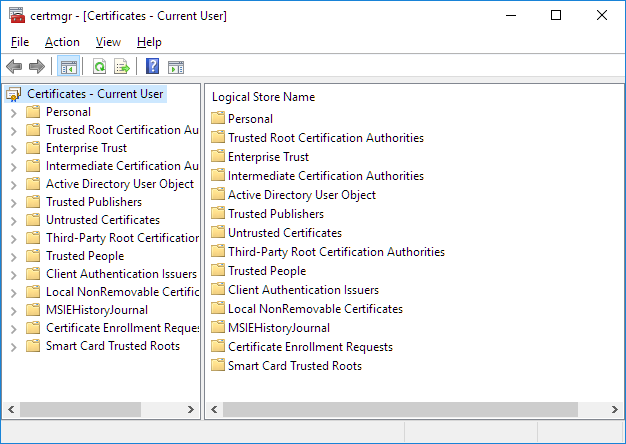
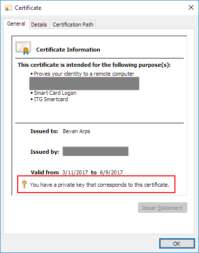
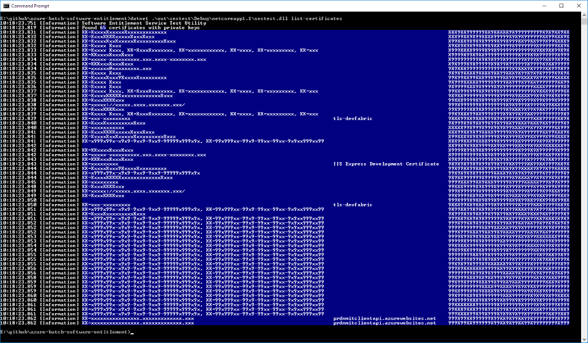

# Software Entitlement Service Walk-through

This walk-through will guide you through initial use of the Software Entitlement Service SDK, building the tooling from source code, generating and then verifying a software entitlement token.

## Table of Contents

* [Prerequisites](#prerequisites)
* [Building the tools](#building-the-tools)
* [Selecting Certificates](#selecting-certificates)
* [Generating a token](#generating-a-token)
* [Starting the test server](#starting-the-test-server)
* [Verifying a token](#verifying-a-token)

## A note on consoles

The SDK has been written to be cross platform, working on Windows, Linux and Macintosh. For brevity, this walk-through uses PowerShell only (usable on both Windows and [Linux](https://azure.microsoft.com/blog/powershell-is-open-sourced-and-is-available-on-linux/)); the commands shown should be trivially convertible to your console of choice, including `cmd` and `bash` (including bash on Windows).

## Prerequisites

To build and use the Software Entitlement Services Test tool (`sestest`) you will need certain prerequisites installed on your system:

The `sestest` command line application and associated assemblies are written in C#7 and require version 1.1 or higher of [.NET Core](https://www.microsoft.com/net/core#windowsvs2017) to be pre-installed. The tool was written with Visual Studio 2017; it should compile with just the .NET Core installation. For more information see the [Sestest command line utility](../src/sestest/).

The C++ source for the client library requires [libcurl](https://curl.haxx.se/libcurl/) and [OpenSSL](https://www.openssl.org/) libraries as packaged by [vcpkg](https://blogs.msdn.microsoft.com/vcblog/2016/09/19/vcpkg-a-tool-to-acquire-and-build-c-open-source-libraries-on-windows/). The library was also written with Visual Studio 2017; it should compile with any modern C++ compiler. For more information (including details of configuration and use of `vcpkg`) see the [Software entitlement service native client library](../src/Microsoft.Azure.Batch.SoftwareEntitlement.Client.Native)

## Building the tools

Open a console window to the root directory of the repository.

Compile the cross platform (.NET) based tooling with the convenience PowerShell script:

``` PowerShell
.\build-xplat.ps1
```

or compile it manually:

``` PowerShell
dotnet restore .\src\sestest
dotnet build .\src\sestest
```

To compile the native code on Windows with the script:

``` PowerShell
.\build-windows -platform x64 -configuration Debug
```

or you can commpile it manually:

``` PowerShell
msbuild .\src\Microsoft.Azure.Batch.SoftwareEntitlement.Client.Native /property:Configuration=Debug /property:Platform=x64
msbuild .\src\sesclient.native /property:Configuration=Debug /property:Platform=x64
```

The first `msbuild` command shown above builds the library, the second builds a wrapper executable provided for testing purposes.
The commands shown assume that **msbuild** is availble on the PATH (as it will be if you open a *Developer Command Prompt for VS 2017* window.)'

Details of the required buld will differ if you are using a different C++ compiler or are building on a different platform.

### Troubleshooting the builds

TBC

### Checking that it works

If compilation works without any issues, you should now have the executables you need for testing.

Run the `sestest` console application to verify it is ready for use.

``` PowerShell
.\sestest
```

You should get output similar to this:

``` 
sestest 1.0.0
Copyright (C) 2017 Microsoft

ERROR(S):
  No verb selected.

  generate             Generate a token with specified parameters

  server               Run as a standalone software entitlement server.

  list-certificates    List all available certificates.

  find-certificate     Show the details of one particular certificate.

  help                 Display more information on a specific command.

  version              Display version information.
```

You should also run the `sesclient.native.exe` console application to verify it is ready for use:

```
.\sesclient
```

You should get output similar to this:

``` 
Contacts the specified azure batch software entitlement server to verify the provided token.
Parameters:
    --url <software entitlement server URL>
    --thumbprint <thumbprint of a certificate expected in the server's SSL certificate chain>
    --common-name <common name of the certificate with the specified thumbprint>
    --token <software entitlement token to pass to the server>
    --application <name of the license ID being requested>
```

## Selecting Certificates

The software entitlement service makes use of three digital certificates as follows:

* To digitally sign the generated entitlement token
* To encrypt the generated entitlement token
* To authenticate the software entitlement service

In production, three different certificates will be used, but for test scenarios you are welcome to use the same certificate for all three.

For each required certificate you will need to know the *thumbprint* of that certificate. The SES tooling is not sensitive to the format of the thumbprint.

### Windows

On the Windows platform, one way to find suitable certificates is to use the built in certificate manager.



At minimum, you must use a certificate that has a private key.



### Sestest

To assist with finding a suitable certificate, the `sestest` utility has a **list-certificates** mode that will list certificates that *may* work (the tool only shows certificates with a private key).

```
.\sestest list-certificates
```

The output from this command is tabular, so we recommend using a console window that is as wide as possible.



(Yes, this output is obfuscated.)

### Checking a thumbprint

Once you've selected a thumbprint for use, you can verify it using `sestest` (Substitute your own thumbprint for `XXX`).

```
.\sestest find-certificate --thumbprint XXXXXXXXXXXXXXXXXXXXXXXXXXXXXXXXXXXXXXXX
```
For a thumbprint containing whitespace (as it will if copied from the Windows certificate properties dialog), wrap the thumbprint in quotes.

```
.\sestest find-certificate --thumbprint "XX XX XX XX XX XX XX XX XX XX XX XX XX XX XX XX XX XX XX XX"
```

If `sestest` successfully finds the certificate, some information about the certificate will be shown:

``` 
10:26:13.119 [Information] ---------------------------------------------
10:26:13.119 [Information]   Software Entitlement Service Test Utility
10:26:13.119 [Information] ---------------------------------------------
10:26:13.168 [Information] [Subject]
10:26:13.170 [Information]   CN=localhost
10:26:13.171 [Information]
10:26:13.171 [Information] [Issuer]
10:26:13.172 [Information]   CN=localhost
10:26:13.174 [Information]
10:26:13.175 [Information] [Serial Number]
10:26:13.176 [Information]   XXXXXXXXXXXXXXXXXXXXXXXXXXXXXXXX
10:26:13.177 [Information]
10:26:13.180 [Information] [Not Before]
10:26:13.182 [Information]   7/12/2016 10:50:46 AM
10:26:13.182 [Information]
10:26:13.184 [Information] [Not After]
10:26:13.185 [Information]   7/12/2021 12:00:00 PM
10:26:13.186 [Information]
10:26:13.187 [Information] [Thumbprint]
10:26:13.188 [Information]   XXXXXXXXXXXXXXXXXXXXXXXXXXXXXXXXXXXXXXXX
```

If `sestest` is unable to find the certificate, you will get an error like this:

``` 
10:34:59.211 [Information] ---------------------------------------------
10:34:59.211 [Information]   Software Entitlement Service Test Utility
10:34:59.211 [Information] ---------------------------------------------
10:34:59.305 [Error] Did not find cert certificate XXXXXXXXXXXXXXXXXXXXXXXXXXXXXXXXXXXXXXXX
```

## Generating a token

The `generate` mode of `sestest` is used to generate a token. The command has the following parameters:

| Parameter        | Definition                                                                                                                                                                           |
| ---------------- | ------------------------------------------------------------------------------------------------------------------------------------------------------------------------------------ |
| --application-id | Unique identifier(s) for the applications(s) to include in the entitlement (comma separated).                                                                                        |
| --vmid           | Unique identifier for the Azure virtual machine (mandatory).                                                                                                                         |
| --not-before     | The moment at which the token becomes active and the application is entitled to execute <br/> Format 'hh:mm d-mmm-yyyy'; 24 hour clock; local time; defaults to now.                 |
| --not-after      | The moment at which the token expires and the application is no longer entitled to execute <br/> Format 'hh:mm d-mmm/-yyyy'; 24 hour clock; local time; defaults to 7 days from now. |
| --address        | The externally visible IP addresses of the machine entitled to execute the application(s). <br/> Defaults to all the IP addresses of the current machine.                            |
| --sign           | Certificate thumbprint of the certificate used to sign the token                                                                                                                     |
| --encrypt        | Certificate thumbprint of the certificate used to encrypt the token.                                                                                                                 |
| --token-file     | The name of a file into which the token will be written <br/> Token will be logged otherwise.                                                                                        |
| --log-level      | Specify the level of logging output. <br/> One of *error*, *warning*, *information* or *debug*; defaults to *information*.                                                           |
| --log-file       | Specify a file into which log messages should be written. <br/> Logging is shown on the console by default.                                                                          |

You can see this documentation for yourself by running `sestest generate --help` in your console.

Run `sestest generate` with no parameters.

```
.\sestest generate
```

Typical output:

```
10:53:59.102 [Information] ---------------------------------------------
10:53:59.102 [Information]   Software Entitlement Service Test Utility
10:53:59.102 [Information] ---------------------------------------------
10:53:59.164 [Error] No applications specified.
10:53:59.164 [Error] No virtual machine identifier specified.
```

Running `sestest generate` with just the mandatory parameters supplied will generate a minimal token.

```
.\sestest generate --vmid machine-identifier --application-id contosoapp
```

```
10:57:15.616 [Information] ---------------------------------------------
10:57:15.616 [Information]   Software Entitlement Service Test Utility
10:57:15.616 [Information] ---------------------------------------------
10:57:15.882 [Information] Token: "eyJhbGciOiJub25lIiwidHlwIjoiSldUIn0.eyJ2bWlkIjoibWFjaGluZS1pZGVu
dGlmaWVyIiwiaXAiOlsiMTAuMTY4LjI0NC4xNDIiLCJmZTgwOjpiOTZjOjMyYTY6ZTI0OjVjN2QlNCIsIjI0MDQ6ZjgwMTo2ODE
4OjIxMjpiOTZjOjMyYTY6ZTI0OjVjN2QiLCI6OjEiLCIxMjcuMC4wLjEiLCIyNDA0OmY4MDE6NjgxODoyMTI6ODg0Mzo5YWI2Oj
JkZWI6OGRjMSJdLCJhcHAiOiJjb250b3NvYXBwIiwibmJmIjoxNDkyNjQyNjM1LCJleHAiOjE0OTMyNDc0MzUsImlhdCI6MTQ5M
jY0MjYzNSwiaXNzIjoiaHR0cHM6Ly9iYXRjaC5henVyZS5jb20vc29mdHdhcmUtZW50aXRsZW1lbnQiLCJhdWQiOiJodHRwczov
L2JhdGNoLmF6dXJlLmNvbS9zb2Z0d2FyZS1lbnRpdGxlbWVudCJ9."
```
(This has been artificially wrapped at 100 columns width.)

Include the option `--log-level debug` to get more information about what is included in the token.

```
.\sestest generate --vmid machine-identifier --application-id contosoapp --log-level debug
```

```
12:27:36.577 [Information] ---------------------------------------------
12:27:36.577 [Information]   Software Entitlement Service Test Utility
12:27:36.577 [Information] ---------------------------------------------
12:27:36.656 [Debug] Virtual machine Id: machine-identifier
12:27:36.668 [Debug] IP Address: 99.999.999.999
12:27:36.669 [Debug] IP Address: xx99::x99x:99x9:x99:9x9x%9
12:27:36.670 [Debug] IP Address: ::9
12:27:36.671 [Debug] IP Address: 999.9.9.9
12:27:36.673 [Debug] IP Address: 9999:x999:9999:999:x99x:99x9:x99:9x9x
12:27:36.674 [Debug] IP Address: 9999:x999:9999:999:9999:9xx9:9xxx:9xx9
12:27:36.679 [Debug] Application Id: contosoapp
12:27:36.680 [Debug] Not Before: 4/20/2017 12:27:36 PM +12:00
12:27:36.681 [Debug] Not After: 4/27/2017 12:27:36 PM +12:00
12:27:36.812 [Debug] Raw token: {"alg":"none","typ":"JWT"}.{"vmid":"machine-identifier","ip":["99.9
99.999.999","xx99::x99x:99x9:x99:9x9x%9","::9","999.9.9.9","9999:x999:9999:999:x99x:99x9:x99:9x9x",
"9999:x999:9999:999:9999:9xx9:9xxx:9xx9"],"app":"contosoapp","nbf":1492648056,"exp":1493252856,"iat
":1492648056,"iss":"https://batch.azure.com/software-entitlement","aud":"https://batch.azure.com/so
ftware-entitlement"}
12:27:36.818 [Information] Token: "eyJhbGciOiJub25lIiwidHlwIjoiSldUIn0.eyJ2bWlkIjoibWFjaGluZS1pZGVu
dGlmaWVyIiwiaXAiOlsiOTkuOTk5Ljk5OS45OTkiLCJ4eDk5Ojp4OTl4Ojk5eDk6eDk5Ojl4OXglOSIsIjo6OSIsIjk5OS45Ljk
uOSIsIjk5OTk6eDk5OTo5OTk5Ojk5OTp4OTl4Ojk5eDk6eDk5Ojl4OXgiLCI5OTk5Ong5OTk6OTk5OTo5OTk6OTk5OTo5eHg5Oj
l4eHg6OXh4OSJdLCJhcHAiOiJjb250b3NvYXBwIiwibmJmIjoxNDkyNjQ4MDU2LCJleHAiOjE0OTMyNTI4NTYsImlhdCI6MTQ5M
jY0ODA1NiwiaXNzIjoiaHR0cHM6Ly9iYXRjaC5henVyZS5jb20vc29mdHdhcmUtZW50aXRsZW1lbnQiLCJhdWQiOiJodHRwczov
L2JhdGNoLmF6dXJlLmNvbS9zb2Z0d2FyZS1lbnRpdGxlbWVudCJ9."
```

Note especially the `[Debug]` information that shows the actual values that have been used for the parameters we haven't supplied ourselves, such as `--not-before`, `--not-after` and `--address`. (Again, the above output has been wrapped to 100 columns and partially obfuscated.)

To digitally sign the token, specify a certificate with the `--sign` option; to encrypt the token, specify a certificate with the `--encrypt` option. 

```
.\sestest generate --vmid machine-identifier --application-id contosoapp --sign <signing-thumbprint> --encrypt <encryption-thumbprint> --log-level debug
```

```
14:06:43.861 [Information] ---------------------------------------------
14:06:43.861 [Information]   Software Entitlement Service Test Utility
14:06:43.861 [Information] ---------------------------------------------
14:06:43.966 [Debug] Virtual machine Id: machine-identifier
14:06:43.977 [Debug] IP Address: 99.999.999.999
14:06:43.977 [Debug] IP Address: ::9
14:06:43.980 [Debug] IP Address: xx99::x99x:99x9:x99:9x9x%9
14:06:43.980 [Debug] IP Address: 999.9.9.9
14:06:43.982 [Debug] IP Address: 9999:x999:9999:999:x99x:99x9:x99:9x9x
14:06:43.982 [Debug] IP Address: 9999:x999:9999:999:9999:9xx9:9xxx:9xx9
14:06:43.985 [Debug] Application Id: contosoapp
14:06:43.987 [Debug] Not Before: 4/20/2017 2:06:43 PM +12:00
14:06:43.989 [Debug] Not After: 4/27/2017 2:06:43 PM +12:00
14:06:44.165 [Debug] Raw token: {"alg":"RSA-OAEP","enc":"A256CBC-HS512","kid":"<thumbprint>","typ":
"JWT"}.{"vmid":"machine-identifier","ip":["99.999.999.999","::9","xx99::x99x:99x9:x99:9x9x%9","999.
9.9.9","9999:x999:9999:999:x99x:99x9:x99:9x9x","9999:x999:9999:999:9999:9xx9:9xxx:9xx9"],"app":"con
tosoapp","nbf":1492654003,"exp":1493258803,"iat":1492654003,"iss":"https://batch.azure.com/software
-entitlement","aud":"https://batch.azure.com/software-entitlement"}
14:06:44.172 [Information] Token: "eyJhbGciOiJSU0EtT0FFUCIsImVuYyI6IkEyNTZDQkMtSFM1MTIiLCJraWQiOiI2
RDRDOEUyM0U5QzcwRDc4RjQwMkJFOTQyMkJGNDRDRTU0NjVDRDFBIiwidHlwIjoiSldUIn0.q20Q126UMvDJWoD9iQiYq-g4CvE
XOXFIZ0ow2Gt3oERzH6yJ4J1RkllBPiCDjzeWVpnlltr5u-TKL1eSWOIf9s-3ESdIhNWT5M7UZUXHN7HdC_YyGE5PvT1SWnUfdj
frYWBwcLkwzr5hrGrdTdmq-Z5t-j_hHP3D32bkYl4WxoVWuxgBr5YyL0Z620lTqMUvZ1_8kLNpUw5L4BwNWBSt9BK4PDk9f1wEw
WkFqV5LQ_hLObHUSWU5j3zZo3sYSBBC_be7bs1GIOUiWSAsvr5XnbrAPBmBabLBccOyrI2dRf1nzWyWpWDinSV_9NJWUtG11Yta
uKK726zr5pr1KVbZuw.TU5K-5s3NbYRDh4z7rbvTA.nsIacvaHdNNRpP0V9WcobTU7-O17fPX4nfyfCpBd0o_4MCqanUxrMgTLR
y7gXd4V2E2kDFQ4EgZfiE_raGDHeRCP3pdcBMow8Vzm4YGQyV65w-u8XfQc-e1LLMuYW1i0RMzPVztEVxmmTCKhy9bkaCZpwApU
KaokvTcYroglWjrOxT-tqba0bPEAM0uPqjzb81WTbTGtMe8EC1oZnkJ0fIx4K_VJErMpWTeL365jK-1uk9PEPF7Zeol6wOPr44B
zu3AUc7NDqONuTSOLYQ7N2SA9UmwE2RrLzBgTINcg6EvA3hOqhW5kPk36-P69ZlieYRBdple72V1vqk6sO6vo8S3BW8w_Hp4p0V
qe41zZiYQHAaoUC1XzuRvTu4W-cD8olDqjpTFS5w3WCA8FyfaVvvMqQNn6erxxCF5-zLhP91vwSYko72hSJAVlYnby6dKDSl0SN
3WHilTNSeF5Yi9C7bZVRnAyS5nL5if3RfbBVdaB1mrI5dwpJtNRzHh9vwp2Y2C4nAIfx4__lVHt_josliQoIxyMpKwq6hhQhv7J
kybPtiLF6tZK4WZ9pXVwBGufvKg5jpsydPjNEn0oAZnzF5oiVaqSyIGi4Bq97Nnad_MnKrYH-gl5Y4AhtaoR2RvhZqyYWjtqG8Z
Mh4cO661X00HYLPQIS0GrQuvHGIJdN5EiX4NxE3tu8JH-oeUT6oxysim30RwO9Dsn2IMHG2gEesnQA9-lmRgWu-S-FX2CTKT3Hd
QfsmHumLkjFxQSM46mEtM73j_tEHgujb81L9qYORYxMP2eKU-WdcV7KWd5aXrJ6QvV6oOTEsoGBGvmjz3TVAQUFuAiY7WtjRiod
qD6SGeAJ8yfbxZ1XA3t7DTenOv1znkU3Hbmo0M3MPJXdebzhDHTU0fuCYTuSC3kuDA8v8P2ffPoSOSvMNyMIvzwSUCawWzY1L1l
1r7_q-xfvDp-OE7wjVBP-3JMMuThM5EdSy6DhSyNBteMInr1LjBSmI8NMqMsX1JVZS30sJmAwP2TBXHFWNTR9rdsoWiqIBMEGSy
uOZS3tTbPPyBxle9OJE149TeV2G6kc7I6Ni3xnXcyHAWLrm0qs4owiUJmBJyco0E711o9tXHKJO8uAxotoIPbjbg2Tcl_iJ8iAF
eLz74V3wHioYUC3tHiYC9HH0HJGPCX8oFOS7vCzZrCk1aRTJ1bzA52yYVEsIPPJhSararzs3qmQlAYpm-OkU2ori-7lg.7WfJBL
Ajt9tTffxB6lRlMxeXi25ejR-b4Kul34A3A3w"
```

An encrypted token is longer, in part due to information about the required key that's included within.
In production, all tokens will be both signed and encrypted.

## Starting the test server

The **server** mode of `sestest` provides an HTTPS endpoint that acts as a fully functioning software entitlement server that can be used during development and testing. The command has the following parameters:

| Parameter    | Required  | Definition                                                                                                                |
| ------------ | --------- | ------------------------------------------------------------------------------------------------------------------------- |
| --connection | Mandatory | Thumbprint of the certificate to pin for use with HTTPS.                                                                  |
| --sign       | Optional  | Thumbprint of the certificate used to sign tokens. <br/> If specified, all tokens must be signed.                         |
| --encrypt    | Optional  | Thumbprint of the certificate used to encrypt tokens. <br/> If specified, all tokens must be encrypted.                   |
| --url        | Optional  | The URL at which the server should process requests <br/> Defaults to `https://localhost:4443`; must start with `https:`. |
| --log-level  | Optional  | Specify the level of logging output.<br/>One of *error*, *warning*, *information* or *debug*; defaults to *information*.  |
| --log-file   | Optional  | Specify a file into which log messages should be written.                                                                 |

You can see this documentation for yourself by running `sestest server --help` in your console.

Run the server with minimum parameters (just a connection certificate thumbprint).

```
.\sestest server --connection <thumbprint>
```

The server will start up and wait for connections

```
17:20:02.676 [Information] ---------------------------------------------
17:20:02.695 [Information]   Software Entitlement Service Test Utility
17:20:02.696 [Information] ---------------------------------------------
17:20:02.977 [Debug] Hosting starting
17:20:03.043 [Debug] Hosting started
Hosting environment: Production
Content root path: E:\github\azure-batch-software-entitlement\out\sestest\Debug\netcoreapp1.1
Now listening on: https://localhost:4443
Application started. Press Ctrl+C to shut down.
```

Use Ctrl+C to shut down the server when no longer needed.

```
Application is shutting down...
17:20:09.008 [Debug] Hosting shutdown
```

## Verifying a token
